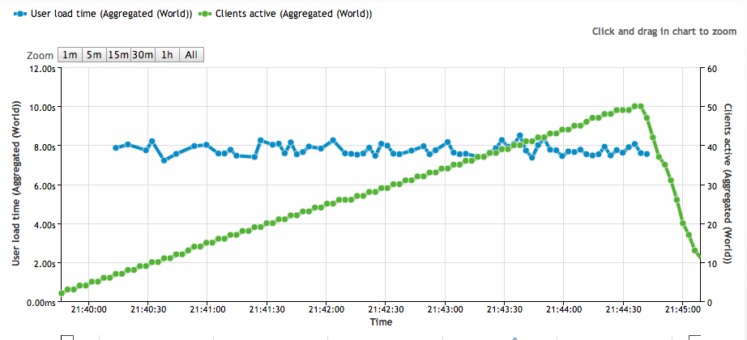
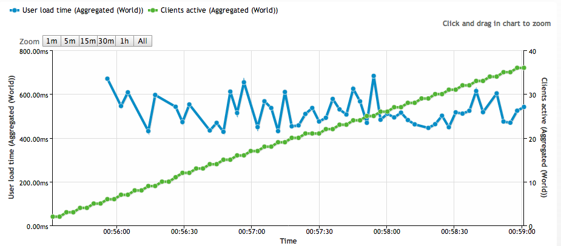

Fun and Profit, Through Amazon CloudFront
=====================================

_Can we speed up the load time of landing page to sub-2-seconds?_, this ticket had been kicking around in our backlog for quite some time. We'd consistently made attempts to deliver assets efficiently:

* CSS and JavaScript was combined and minified.
* static assets were served directly through Nginx.
* Nginx was configured to gzip the assets that it delivered.

Regardless of these efforts, our landing page's loading times were becoming abysmal:



As the graph above shows, our load-times were pushing 8-seconds!

AWS provides a Content Distribution Network called CloudFront. I had wanted to try out CloudFront for quite some time, figuring that it would be a quick performance win; While I expected speed improvements, I was blown away by just how much faster load times ended up being.

In this post I'll:

* give a quick introduction to setting up CloudFront.
* outline how we moved our assets over to CloudFront in an incremental manner.
* briefly go over some of the issues we encountered.
* discuss the performance improvements we ultimately witnessed.

How CloudFront Works
--------------------

To start using CloudFront, you create what is called a Distribution. A Distribution consists of an Origin Domain Name, and various configuration settings (mostly related to how assets are cached). When a visitor to your website requests an asset from the CDN, if the asset has already been retrieved it will be served immediately. If a user requests an asset that has never been pulled into the CDN, the CDN will attempt to load the asset from the Origin Domain Name. Let's look at a real-world example:

* Attachments.me has a CloudFront Distribution at the URL https://drvlo06w0956l.cloudfront.net, with the Origin Domain Name of https://attachments.me
* Let's suppose that a user requests the asset: https://drvlo06w0956l.cloudfront.net/images/marketing/logo.png
* If _logo.png_ is already cached in CloudFront, it will be served immediately.
* If _logo.png_ is not already cached in CloudFront, the asset will be loaded from the Origin Domain Name: https://attachments.me/images/marketing/logo.png

So simple! CloudFront accepts a request for an asset at a given path, either servers the asset, or loads the asset from the corresponding path of the Origin Domain Name.

Moving Assets over to CloudFront
--------------------------------

Rather than immediately switching our entire site to using CloudFront, we decided to incrementally move a few key pages over. This allowed us measure performance, experiment with cache settings, and to perform various other sanity checks before fully-committing to CloudFront. We created several [Rails View Helpers](https://github.com/attachmentsme/cloud_front_helpers) to aid us in this incremental approach.

Once you're ready to move all of your assets over to CloudFront, if like us you're using Ruby on Rails, You can simply add this line to your _production.rb_ file:

```ruby
config.action_controller.asset_host = "drvlo06w0956l.cloudfront.net"
```

At this point helpers such as, _image\_tag_, _stylesheet\_link\_tag_, etc, will take this base-URL into account.

Some Caveats
------------

When setting up CloudFront, we ran into some issues with the way our Nginx.conf was configured to serve assets. After a bit of research we ended up modifying some of our settings:

* we changed _expires_ to _max_, indicating to CloudFront that it can hold on to a cached asset for a long period of time.
* we set _gzip\_http\_version_ to _1.0_, and _gzip\_static_ to _on_. Without these flags, CloudFront does not serve zipped assets.
* we set _Cache-Control_ to public, this indicates that the asset can be stored in a publicly available location.
* we set _Last-Modified_ to _""_, some browsers request an asset before it expires if this flag is set.

Here's what our Nginx settings ended up looking like:

```nginx
location ~ ^/assets/ {
    allow all;
    root /var/www/current/public;
    expires max;
    gzip_http_version 1.0;
    gzip_static  on;
    add_header   Last-Modified "";
    add_header   Cache-Control public;
    break;
}
```

The Final Numbers
-----------------

After all this hard work, how much faster were our page-load-times?



wow! page-load-times went from the original 8-seconds, down to approximately 500-milliseconds, a 1600% improvement.

Pulling in CloudFront was definitely well worth the trouble, and we learned a valuable lesson about the benefits of CDNs. To improve the user experience of your website, I suggest pulling your assets in to a CDN such as CloudFront sooner rather than later -- other performance improvements are micro-optimizations comparatively.

-----------------
_Benjamin Coe_ is the co-founder of [Attachments.me](https://attachments.me), he can often be found [tweeting](https://twitter.com/#/benjamincoe) and [coding](https://github.com/bcoe).
