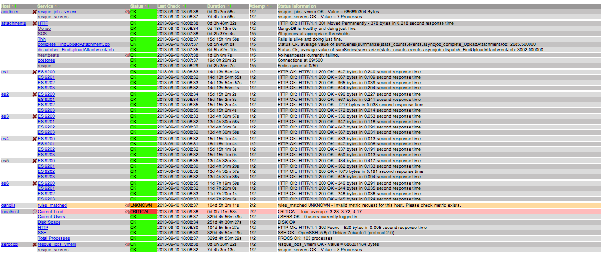
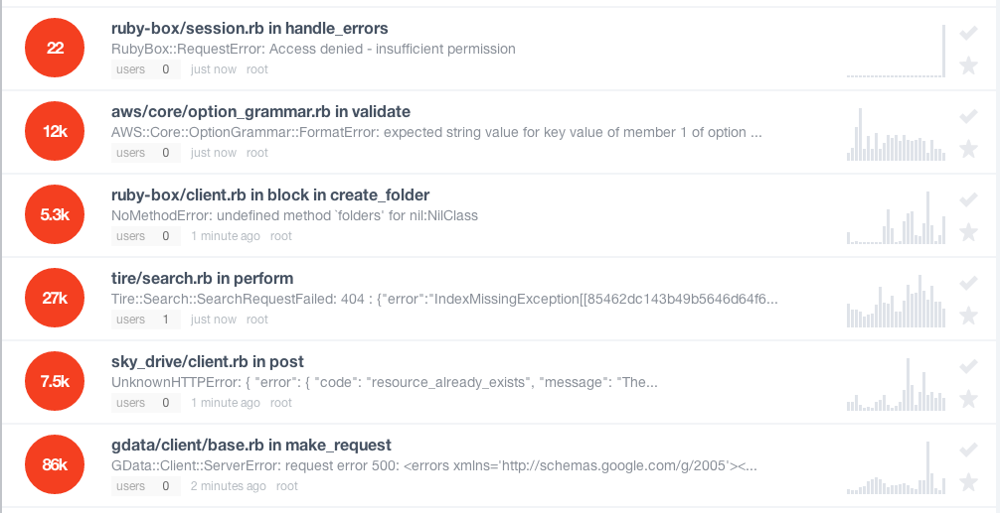
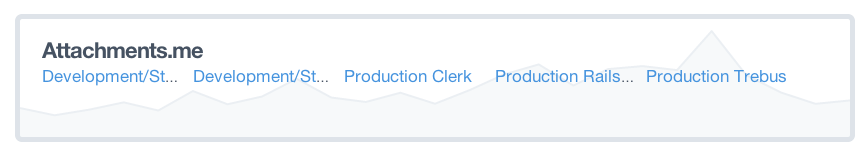
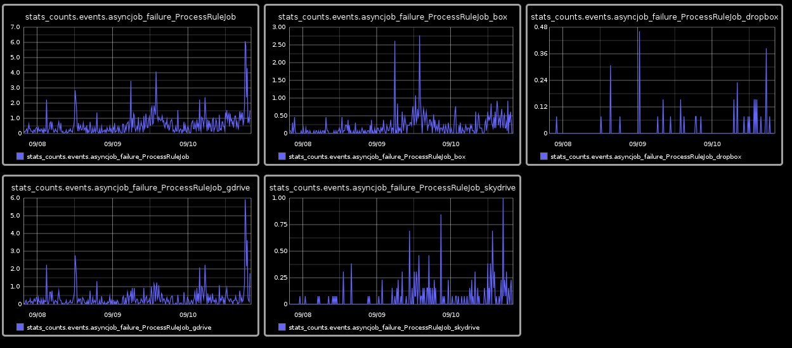
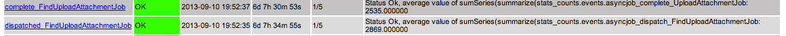

The Quantified Site
===================

Attachments.me has many dependencies:

* Gmail's IMAP.
* cloud-storage providers: Dropbox, Box, SkyDrive, Google Drive, Egnyte.
* our own [image thumbnailing service](https://github.com/bcoe/thumbd).
* Crocodoc.

A year ago, we realized we had problems. When queues started backing up, and Attachments.me slowed down, it was difficult for us to isolate the exact causes of problems:

* was our database missing an index, resulting in slow queries?
* was our ElasticSearch cluster ready to tip over?

or, was it something outside of our control?

* was Google Drive down?
* did a user have tens-of-thousands of spam-emails pouring into their email account, resulting in a DoS attack on our system?

Our real underlying problem was a lack of visibility. 

This is a story about how we used technologies, such as Nagios, Graphite, StatsD, and Sentry, to gain visibility into our system. This visibility allowed us to rapidly isolate problems in our distributed architecture, reducing stress, and allowing us to iterate faster.

Nagios
------

Nagios monitors key components of our infrastructure, and sends alerts if they're behaving abnornamly; ensuring that someone's phone rings at 3:00AM if there's a major ops-problem.

Nagios ships with plugins for monitoring various services: _check\_http_, _check\_disk_, _check\_ssh_, etc. Where it really shines, is that it's so easy to extend with your own plugins. We've written plugins for:

* monitoring MongoDB's replication status.
* monitoring the number of concurrent connections to PostgreSQL.
* monitoring the number of messages in our Resque queues.
* monitoring the number of messages in our SQS queues.
* monitoring important metrics in Graphite (more on this later.)

When you release a major bug into production, it's useful to have a retrospective. What were the breakdowns in process that allowed for the mistake? Similarly, if we have an operational issue and Nagios fails to notify us, we put a check in Nagios going forward.

Here's what we currently have Nagios monitoring:

Nagios does a great job of notifying us when a major piece of infrastructe is exploding. It doesn't, however, help us isolate what might be causing the problem. Nor does it tell us when a peice of infrastructure is running abnormally, e.g., when we've released a buggy version of the website. Sentry, and StatsD/Graphite, are better suited for these tasks.

Sentry
------

In production, our unhandled exceptions bubble up to [GetSentry](https://getsentry.com/welcome/), a hosted version of David Cramer's [Sentry](https://github.com/getsentry/sentry) library:

* Sentry aggregates together similar exceptions.
* notifies us of newly observed exceptions, as well as regressions.
* and gives us aggregate analytics of exceptions over time.

When releasing Attachments.me, we have a browser-tab open to Sentry's realtime incoming view. If we see a bunch of brand new exceptions flowing in, it's a good indicator that we've released a bug:

Sentry's aggregate metrics can be a good canary-in-the-coal-mine for major issues. For instance, when a cloud storage service recently made an unannounced change to their API, it resulted in a huge spike in Sentry exceptions:

StatsD/Graphite
---------------

StatsD is a daemon that aggregates together statistical-events emitted from your applications. It can, in turn, output this data to Graphite, a tool for visualizing and manipulating graphs.

Attachments.me performs many of operations asynchronously: uploading files to the cloud, thumbnailing images and documents, indexing email. All jobs that we dispatch to a queue are tracked with StatsD:

* an event is emitted when the job is enqueued.
* an event is emitted when the job is pulled off the queue for processing.
* an event is emitted if a job has completed successfully.
* an event is emitted if an exception occurs while processing a job, and it must be retried.
* an event is emitted if a job reaches its maximum retry attempts, and fails.

Emitting StatsD events at these checkpoints, gives us a lot of power to detect anomalies in our system. For instance, if we're enqueuing thousands of Google Drive uploads, but zero are reaching completion, we've got a problem on our hands.

over time, we've determined interesting combinations of graphs that give insight into our system. As an example, here's a dashboard describing the failure rates of different cloud-storage-services:

We've connected Nagios to StatsD, so that we can raise alarms if key-graphs fall into anomalous states. We know, for instance, that attachments-uploaded-per-hour should not fall below the low thousands, unless we're having problems.

StatsD/Graphite is an invaluable tool for detecting bugs in production. On several occasions that we've released a major production bug, and immediately detected it due to a graph spiking or zeroing out.

Our Metrics Board
-----------------

* make sure people understand the metrics that are important to ops.
* put them in a central place, let people know when problems are happening.

Conclusion 
----------

* these tools compliment each other.
* a quantified site has made our lives far better.
* I would get this infrastructure in place out-of-the-gate in the future.